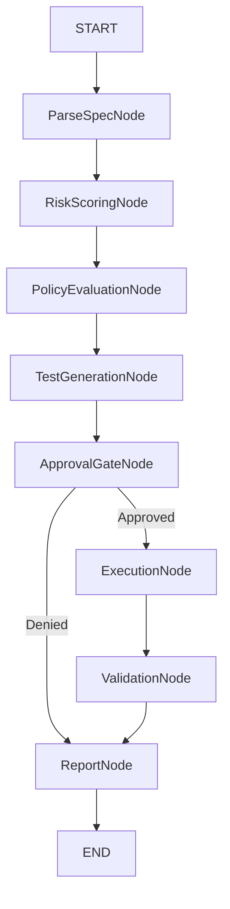

# SYSTEM & ARCHITECTURE DESIGN DOCUMENT

**Product:** AI-Powered OpenAPI-First API Testing Platform
**Audience:** Senior Engineers, Architects, AI Agents
**Status:** Canonical Reference

## 1. Design Objectives

This system is designed to:

*   Convert OpenAPI specifications into executable knowledge
*   Use AI safely, under deterministic orchestration
*   Enforce human control over destructive behavior
*   Produce auditable, explainable, reproducible results
*   Scale from CLI usage to enterprise cloud deployment

## 2. Core Architectural Principles (Non-Negotiable)
### 2.1 OpenAPI as the Single Source of Truth

*   No endpoint, schema, or parameter may exist unless defined in OpenAPI
*   Runtime behavior is always validated against OpenAPI
*   AI agents may reason only over OpenAPI-derived structures

### 2.2 Deterministic Orchestration

*   LangGraph is mandatory
*   No free-running agents
*   No agent-to-agent direct communication
*   All state transitions must be explicit

### 2.3 Explicit State Over Implicit Memory

*   No hidden memory
*   No conversational context
*   Every node receives and returns structured state

### 2.4 Safety Over Coverage

*   The system must prefer failing early over guessing
*   Destructive operations require explicit approval
*   No execution without authorization

## 3. High-Level System Architecture
### 3.1 Logical Architecture Layers

```mermaid
graph TD
    UI[Interface Layer (CLI + Web UI)] --> App[Application Layer (FastAPI Backend)]
    App --> Orch[Orchestration Layer (LangGraph Workflow Engine)]
    Orch --> Exec[Execution & Validation Layer (HTTP, Schema, Policies)]
    Exec --> Persist[Persistence & Audit Layer (Reports, Logs, History)]
```

## 4. Component-Level Design
### 4.1 Interface Layer
**Components**

*   Python CLI
*   React Web UI

**Responsibilities**

*   Accept OpenAPI files
*   Accept credentials (secure input)
*   Trigger test workflows
*   Display human-readable results

**Explicit Non-Responsibilities**

*   No test generation
*   No execution logic
*   No secret storage
*   No AI calls

### 4.2 Application Layer (FastAPI Backend)

Acts as a control plane, not an intelligence layer.

**Responsibilities**

*   Authentication & authorization
*   Secure credential handling
*   Graph execution management
*   Approval persistence
*   Audit logging

**Forbidden Actions**

*   Generating tests
*   Modifying agent outputs
*   Executing HTTP calls directly
*   Making autonomous decisions

## 5. Orchestration Layer (LangGraph)
### 5.1 Why LangGraph

LangGraph is used to:

*   Enforce linear, inspectable workflows
*   Prevent uncontrolled autonomy
*   Expose state transitions for auditing

### 5.2 Graph Topology



## 6. Global Graph State Definition
### 6.1 Canonical State Schema

```python
class GraphState(TypedDict):
    # Input
    spec_raw: dict
    user_config: dict

    # Derived
    spec_normalized: dict
    endpoints: list

    # Intelligence
    risk_scores: dict
    policies: dict

    # Testing
    test_cases: list

    # Safety
    approval_required: bool
    approval_status: bool | None

    # Execution
    execution_results: list

    # Validation
    validation_results: list

    # Output
    report: dict

    # Errors
    errors: list
```

### 6.2 State Invariants

*   State is append-only
*   Nodes may not delete keys
*   Nodes may not mutate previous values
*   Missing required keys = hard failure

## 7. Node-by-Node Design
### 7.1 ParseSpecNode
**Purpose**

Transform raw OpenAPI into a normalized, machine-friendly model.

**Inputs**

*   spec_raw

**Outputs**

*   spec_normalized
*   endpoints

**Rules**

*   Strict OpenAPI validation
*   No assumptions
*   No inferred defaults
*   Fail on ambiguity

### 7.2 RiskScoringNode
**Purpose**

Quantify endpoint danger to drive approvals and test depth.

**Inputs**

*   endpoints

**Outputs**

*   risk_scores

**Risk Factors**

*   HTTP method
*   Auth requirements
*   PII fields
*   Schema complexity

**Constraints**

*   Deterministic scoring
*   No ML inference
*   No runtime behavior analysis

### 7.3 PolicyEvaluationNode
**Purpose**

Apply user-defined organizational rules.

**Inputs**

*   risk_scores
*   user_config.policies

**Outputs**

*   policies
*   Policy violations (if any)

**Rules**

*   Policies override defaults
*   Violations must be explicit
*   No silent enforcement

### 7.4 TestGenerationNode
**Purpose**

Generate test cases aligned with spec + policy.

**Inputs**

*   endpoints
*   policies
*   risk_scores

**Outputs**

*   test_cases

**Mandatory Test Categories**

*   Positive
*   Negative
*   Boundary
*   Auth failure
*   Schema violation

**Constraints**

*   Deterministic
*   Spec-referenced
*   Fully explainable

### 7.5 ApprovalGateNode
**Purpose**

Prevent unsafe execution.

**Inputs**

*   test_cases
*   risk_scores

**Outputs**

*   approval_required
*   approval_status

**Behavior**

*   If approval required and not granted → STOP GRAPH
*   No bypass path
*   Approval must be explicit and logged

### 7.6 ExecutionNode
**Purpose**

Perform HTTP requests safely.

**Inputs**

*   test_cases
*   approval_status
*   credentials (runtime-only)

**Outputs**

*   execution_results

**Safety Rules**

*   No approval → no execution
*   No retries for destructive tests
*   Timeouts enforced
*   Full request/response captured

### 7.7 ValidationNode
**Purpose**

Verify responses against expectations.

**Inputs**

*   execution_results
*   spec_normalized

**Outputs**

*   validation_results

**Validation Types**

*   Status code
*   Response schema
*   Required fields
*   Error format

### 7.8 ReportNode
**Purpose**

Produce immutable test artifacts.

**Inputs**

*   All prior state

**Outputs**

*   report

**Report Must Include**

*   Test rationale
*   Spec references
*   Risk context
*   Failure explanations
*   Execution metadata

## 8. Failure Handling Strategy
### Failure Philosophy

Fail fast, fail loud, fail safely.

| Failure | Action |
| :--- | :--- |
| Invalid spec | Abort |
| Policy violation | Abort |
| Approval denied | Abort |
| Execution error | Test fails |
| Validation mismatch | Test fails |

## 9. Security Architecture
### Secrets Handling

*   Encrypted at rest
*   Decrypted in memory only
*   Never stored in state
*   Never logged

### Approval Auditing

*   Who approved
*   When
*   For which endpoints
*   Immutable logs

## 10. Scalability & Extensibility
### Designed For

*   Multi-environment execution
*   CI/CD integration
*   Historical comparison
*   Plugin-based validators

### Not Designed For (By Choice)

*   Autonomous agents
*   Black-box reasoning
*   Production mutation without consent

## 11. Architectural Constraints Summary

*   No implicit behavior
*   No silent decisions
*   No unsafe defaults
*   No agent autonomy
*   No hallucinated data

## 12. Definition of “Architecturally Correct”

A feature is architecturally correct only if:

*   It fits into the LangGraph flow
*   It modifies state explicitly
*   It respects approval gates
*   It references OpenAPI
*   It produces explainable output
